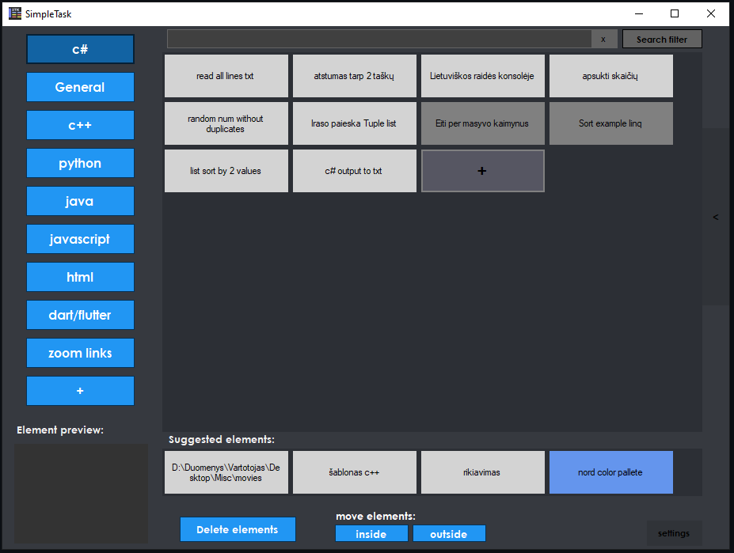
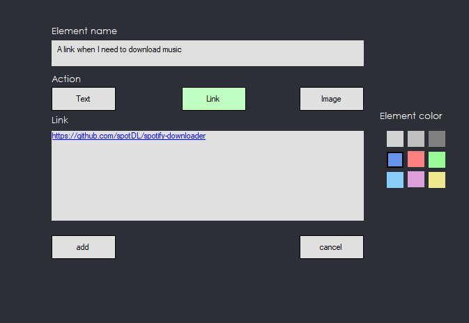
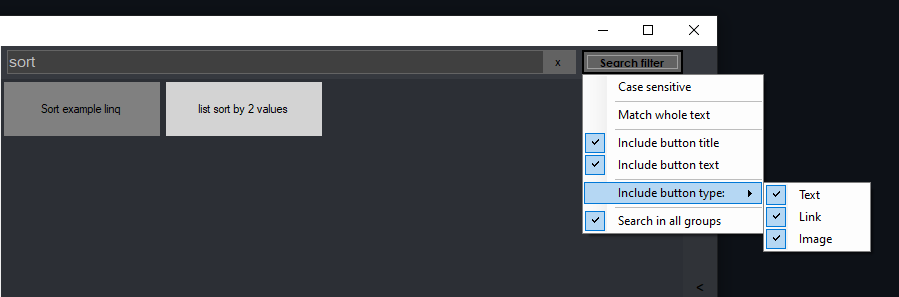
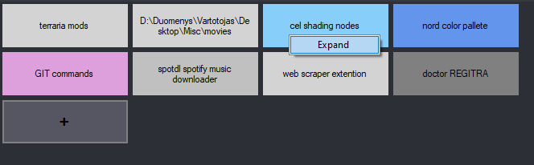
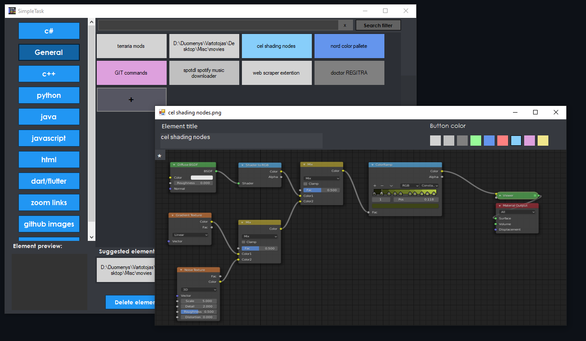

    <h1 align="center">SimpleTask</h1>

 ## A c# program designed to save images, links and notes for easy copy and pasting.
  

    

___

    <h1 align="center">Screenshots</h1>

### Element creation

### Element search

### Expanded element view

___

    <h1 align="center">Other features</h1>

- Element groups
- Moving elements inside/outside groups
- Suggested elements section for quick access to most used elements
- A notes tab for each group

___

### App created as final project for JKM - jaunųjų kompiuterininkų mokykla 2021-05

